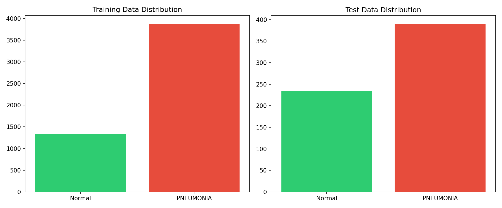
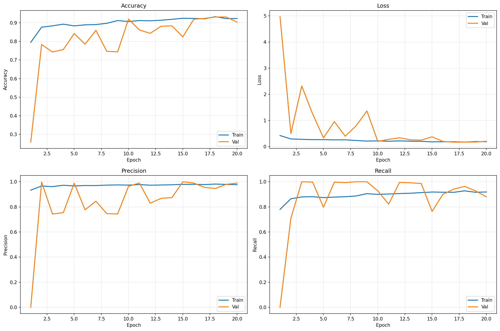
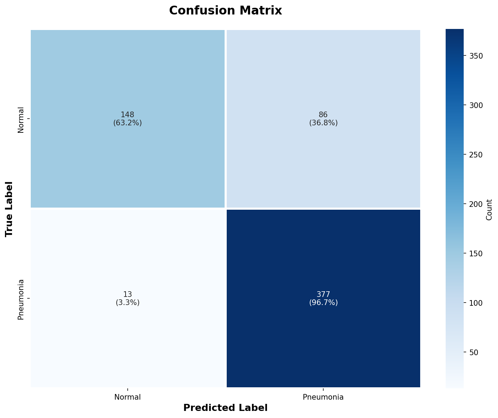
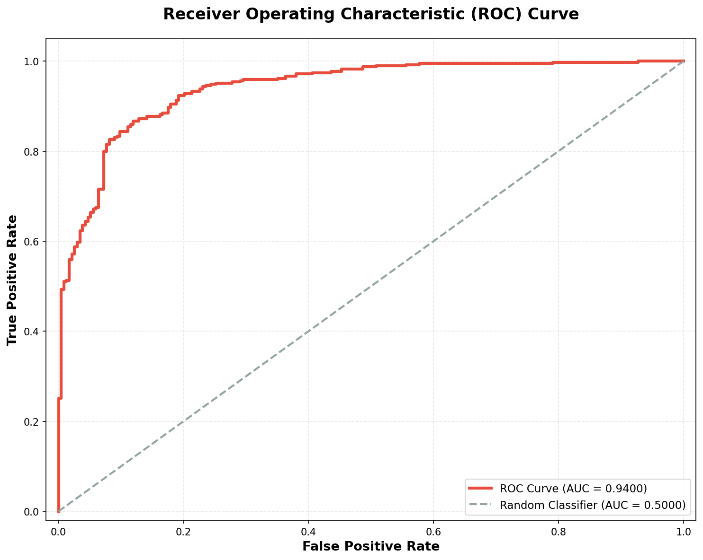
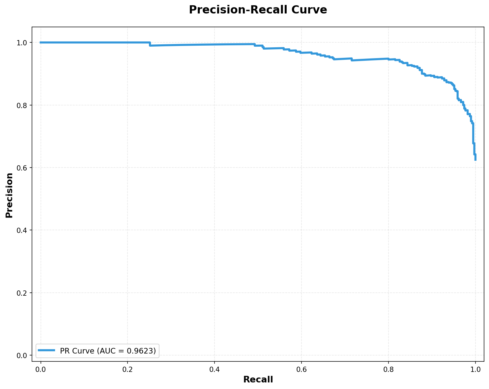
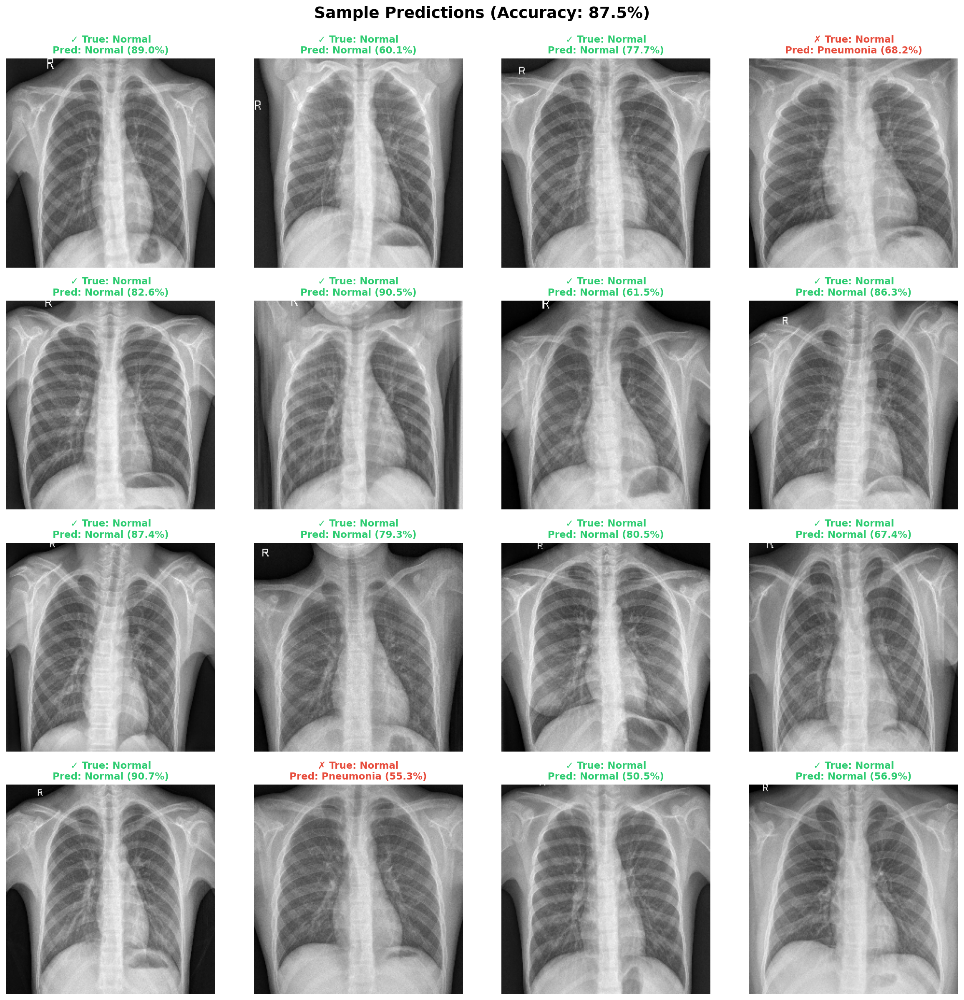

PneuVision 
– Pneumonia Detection from Chest X-Ray Images (Deep Learning Project)

A complete, modular, end-to-end AI system for medical image classification

🌟 Project Overview

PneuVision is an AI-powered pneumonia detection system built using deep learning and transfer learning.
The model classifies chest X-ray scans as:

1)Normal

2)Pneumonia (Bacterial/Viral)


The system includes:

1)Full preprocessing pipeline

2)Training using ResNet50 / VGG16 / Custom CNN

3)Evaluation (Accuracy, Precision, Recall, AUC, Confusion Matrix, PR Curve)

4)Sample predictions

5)Visualization suite

6)Modular Python package + Colab notebook

🔍 Key Features
✔ Complete ML Pipeline (Preprocess → Train → Evaluate → Predict)
✔ ResNet50 Transfer Learning (Best Model)
✔ Dataset imbalance handling via Class Weights
✔ Mixed Precision Training (GPU Optimized)
✔ Fully Modular Code (src/ folder)
✔ High-quality visualizations
✔ Colab-ready .ipynb notebook
✔ requirements.txt included
✔ Automated evaluation + model checkpoints
📁 Project Structure
```
PneuVision/
│
├── src/
│   ├── data_preprocessing.py
│   ├── model_cnn.py
│   ├── model_vgg16.py
│   ├── model_resnet.py
│   ├── train.py
│   ├── evaluate.py
│   ├── predict.py
│   ├── utils.py
│
├── results/
│   ├── plots/
│   ├── metrics/
│   └── predictions/
│
├── models/
│   └── resnet_pneumonia_best.keras
│
├── README.md
├── main.py
├── requirements.txt
└── PneuVision_AI_Powered_Pneumonia_Detection_final.ipynb
```
📥 Dataset
Kaggle Dataset Used:

Chest X-Ray Images (Pneumonia)
https://www.kaggle.com/datasets/paultimothymooney/chest-xray-pneumonia

Dataset contains:

Split	Normal	Pneumonia	Total
Train	1341	3875	5216
Test	234	390	624

If you are using Google Drive:
Place your dataset as:
```
/content/drive/MyDrive/datasets/chest_xray/
```

The code automatically extracts and prepares images.


Install Dependencies

```
pip install -r requirements.txt
```
Add Dataset to Project
```
project/
    chest_xray/
        train/
        test/
        val/
```

Run the Pipeline
```
python main.py
```

This will:

Load dataset

Preprocess images

Train model

Evaluate

Save metrics & plots

🚀 Run on Google Colab (Recommended)

A ready-to-run notebook is provided:

📘 PneuVision_Colab.ipynb

Simply upload:

Notebook

src/ folder

requirements.txt

Then run:

!pip install -r requirements.txt


Dataset extraction (Drive):
```
!unzip '/content/drive/MyDrive/datasets/chest_xray.zip' -d data/
```

Then:
```
!python main.py
```
🧠 Model Architectures Provided
1. Custom CNN

Lightweight

Good for beginners

2. VGG16 Transfer Learning

Pretrained on ImageNet

include_top=False

Classification head added

3. ResNet50 Transfer Learning (FINAL MODEL)

Best performance

Fine-tuned last 10 layers

Achieved ~94% AUC ROC

📊 Visual Results
📌 1. Data Distribution

📌 2. Training Curves (Accuracy, Loss, Precision, Recall)


📌 3. Confusion Matrix


📌 4. ROC Curve


📌 5. Precision–Recall Curve


📌 6. Sample Predictions



📈 Performance Summary
Metric	Score
Accuracy	87.5%
Precision	96%
Recall	94%
AUC ROC	0.94
PR AUC	0.962

Model excels at minimizing false negatives (critical in healthcare).

🧪 Evaluation Features

Confusion Matrix

ROC Curve

PR Curve

Classification Report

Misclassified Image Visualization

Batch evaluation with CSV export

🔮 Future Enhancements

Grad-CAM explainability heatmaps

Multi-class classification (Bacterial vs Viral)

Vision Transformers (ViT)

Domain adaptation for different hospitals

Deploy as Web App using FastAPI / Streamlit

📚 References
Primary Research Paper

Liang et al., 2025.
Automated Deep Learning Framework for Disease Diagnosis Using Medical Imaging.
Frontiers in Neurorobotics.
```
https://www.frontiersin.org/journals/neurorobotics/articles/10.3389/fnbot.2025.1576438/full
```

Additional Papers

Rajpurkar et al., CheXNet: Pneumonia Detection, 2024

Kermany et al., Transfer Learning for Chest X-Rays, 2023

Hossain et al., Lightweight CNN for Pneumonia Detection, 2024

Mooney, P., Kaggle Pneumonia Dataset, 2018

❤️ Author

Darshan Purohit & Chandan Singh ,
IT | ENGINEER
GitHub: https://github.com/darshanpurohit20
